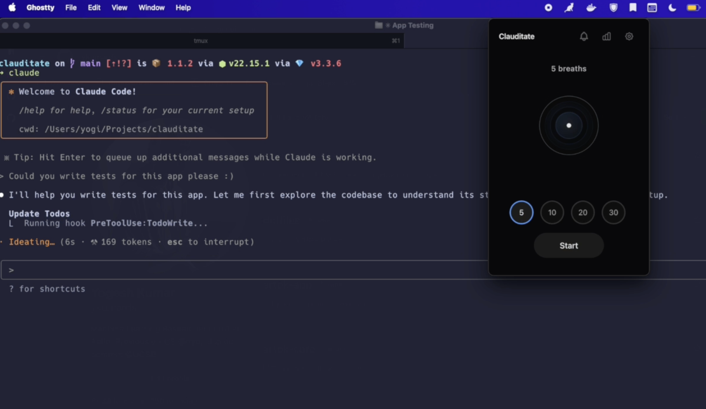

# Clauditate

> **⚠️ Early Release v1.1.4** - Please report issues!
> 
> A menubar meditation app that helps you stay mindful while Claude Code works

Clauditate appears automatically when Claude Code is processing, giving you gentle breathing exercises to keep you present instead of letting your mind wander. Simple, unobtrusive, and surprisingly effective at maintaining focus during development.



## Features

- **Automatic Integration**: Appears when Claude Code is thinking, disappears when done
- **Beautiful Breathing Guide**: Smooth visual animations for inhale/exhale cycles
- **Customizable Sessions**: Choose 5, 10, 20, or 30 breathing cycles
- **Progress Tracking**: Daily, weekly, and monthly meditation insights
- **Celebration**: Gentle confetti animation when sessions complete
- **Menubar App**: Unobtrusive presence in your system tray
- **Cross-platform**: Works on macOS, Windows, and Linux

## Installation

### npm (recommended)
```bash
npm install -g clauditate
clauditate --hook-claude  # Set up Claude Code integration
```

### Homebrew (macOS)
```bash
brew install ykumards/clauditate/clauditate
clauditate --hook-claude  # Set up Claude Code integration
```

### Manual Installation
```bash
git clone https://github.com/ykumards/clauditate.git
cd clauditate
npm install
npm run build
npm link
clauditate --hook-claude
```

## Usage

### Automatic Mode (Recommended)
After running `clauditate --hook-claude`, the app will automatically:
- Show when Claude Code starts any tool operation
- Hide when Claude Code finishes
- Provide gentle breathing guidance during Claude's thinking time

### Manual Mode
```bash
clauditate --start      # Start the meditation app
clauditate --show       # Show the app
clauditate --hide       # Hide the app
clauditate --help       # Show all commands
```

### Managing Integration
```bash
clauditate --hook-claude    # Install Claude Code hooks
clauditate --unhook-claude  # Remove Claude Code hooks
clauditate --update-hooks   # Update hooks to latest version
```

## How It Works

Clauditate uses Claude Code's [hooks system](https://docs.anthropic.com/en/docs/claude-code/hooks) with intelligent timing to create natural meditation moments:

### Hook Integration
1. **PreToolUse Hook**: Triggers when Claude starts any tool (Bash, Edit, Read, etc.)
2. **Smart Timing Algorithm**: Decides whether to actually show the app based on your patterns

### Smart Timing Algorithm
Rather than appearing every time Claude runs a tool, Clauditate uses a thoughtful algorithm:

- **Work Hours**: Only appears during your configured work hours (default 9-5)
- **60-Minute Cliff**: Won't show within 1 hour of your last meditation session
- **Daily Goal Tracking**: Stops appearing once you've hit your daily meditation target
- **Dismissal Backoff**: If you dismiss it twice in 30 minutes, it waits 2 hours before trying again
- **Probability-Based**: Uses remaining work time and goal progress to calculate when you might need a mindful moment

This creates gentle, non-intrusive reminders that respect your workflow while encouraging regular mindfulness practice. The app learns your patterns and becomes less pushy as you build consistent habits.

### Benefits
- Stay mindful during long Claude operations without constant interruptions
- Take breathing breaks during complex tasks when you actually need them
- Maintain focus and reduce stress through natural meditation moments
- Practice mindfulness that adapts to your workflow patterns


## Configuration

Clauditate automatically configures Claude Code hooks in `~/.claude/settings.json`:

```json
{
  "hooks": {
    "PreToolUse": [{
      "matcher": "",
      "hooks": [{"type": "command", "command": "clauditate --smart-show"}]
    }]
  }
}
```

## Development

```bash
git clone https://github.com/ykumards/clauditate.git
cd clauditate
npm install
npm run build
npm run dev  # Start in development mode
```

### Project Structure
```
src/
├── main.ts      # Electron main process
├── renderer.ts  # Frontend meditation interface
├── preload.ts   # Secure IPC bridge
├── cli.ts       # Command-line interface
└── install.ts   # Installation wizard
```

## Contributing

We welcome contributions! Please:

1. Fork the repository
2. Create a feature branch (`git checkout -b feature/amazing-feature`)
3. Commit your changes (`git commit -m 'Add amazing feature'`)
4. Push to the branch (`git push origin feature/amazing-feature`)
5. Open a Pull Request

## ⚠️ Disclaimer

**IMPORTANT**: This is an early release (v1.1.4). While we've tested it carefully:

- This software is provided "AS IS" without warranty of any kind
- **Currently only tested on macOS** - Windows and Linux support is experimental
- Use at your own risk
- We are not responsible for any issues, interruptions, or meditation-induced enlightenment
- **This is an independent project, not officially affiliated with Anthropic Inc. or Claude**
- "Claude" and "Claude Code" are trademarks of Anthropic Inc.
- We are not endorsed by, sponsored by, or otherwise affiliated with Anthropic Inc.

Please report bugs and issues on [GitHub](https://github.com/ykumards/clauditate/issues).

## 📝 License

MIT License - see [LICENSE](LICENSE) file for details.

THE SOFTWARE IS PROVIDED "AS IS", WITHOUT WARRANTY OF ANY KIND, EXPRESS OR
IMPLIED, INCLUDING BUT NOT LIMITED TO THE WARRANTIES OF MERCHANTABILITY,
FITNESS FOR A PARTICULAR PURPOSE AND NONINFRINGEMENT.

## Acknowledgments

- Built with [Electron](https://electronjs.org/) and [TypeScript](https://typescriptlang.org/)
- Integrates with [Claude Code](https://claude.ai/code) hooks system
- Inspired by mindfulness practices and developer wellness

## 🔗 Links

- [GitHub Repository](https://github.com/ykumards/clauditate)
- [npm Package](https://npmjs.com/package/clauditate)
- [Claude Code Documentation](https://docs.anthropic.com/en/docs/claude-code)
- [Report Issues](https://github.com/ykumards/clauditate/issues)

---

*Stay mindful, code peacefully* 🧘‍♀️✨
